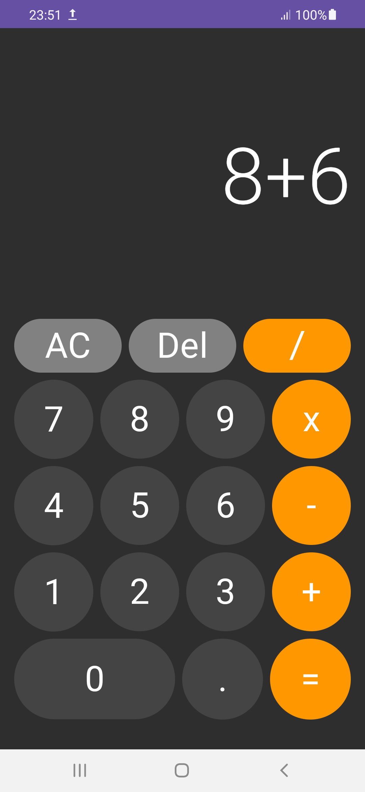
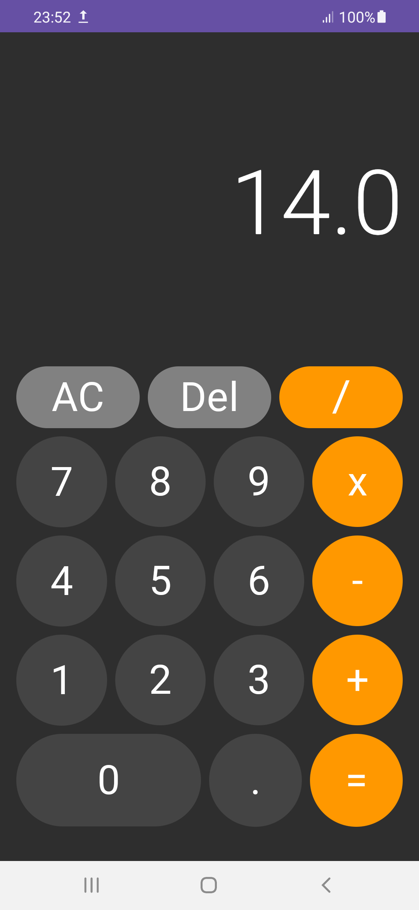

# CalculatorApp in Kotlin

CalculatorApp is a simple calculator application built using Jetpack Compose. Jetpack Compose is Android’s modern toolkit for building native UI. It simplifies and accelerates UI development on Android with less code, powerful tools, and intuitive Kotlin APIs.

## Features

- Simple and clean user interface.
- Basic arithmetic operations: addition, subtraction, multiplication, and division.
- Responsive design using Jetpack Compose.

## Screenshots

    
    

### Prerequisites

- Android Studio
- Kotlin
